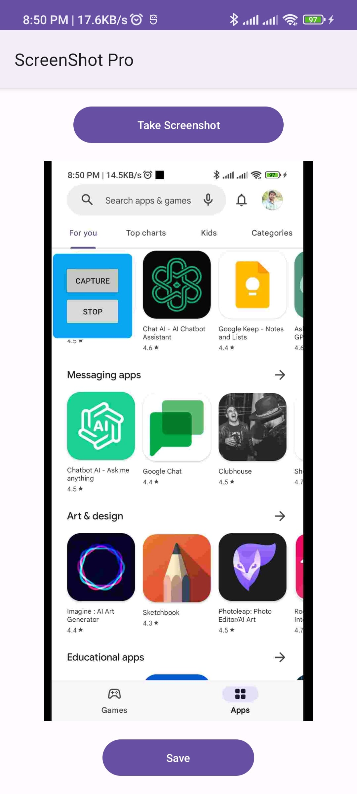

# ScreenShotPro

ScreenShotPro is an Android app that allows you to capture screenshots and combine them vertically into a single image. You can capture screenshots one at a time or in quick succession, and the app will automatically combine them into a single image for easy sharing and saving.

## Features

* Capture single or multiple screenshots
* Combine multiple screenshots vertically into a single image
* Save screenshots to the Downloads directory
* User-friendly interface with intuitive controls

## Technologies Used

* Kotlin programming language
* Android Studio IDE
* Android SDK
* Gradle build system

## Getting Started

To get started with ScreenShotPro, simply clone this repository and open the project in Android Studio. Then, you can build the app and run it on your Android device or emulator.

## Contributing
If you'd like to contribute to ScreenShotPro, feel free to fork this repository and submit a pull request. We welcome contributions of all kinds, including bug fixes, new features, and improvements to the user interface.

## Authors
Abdullah Javed
